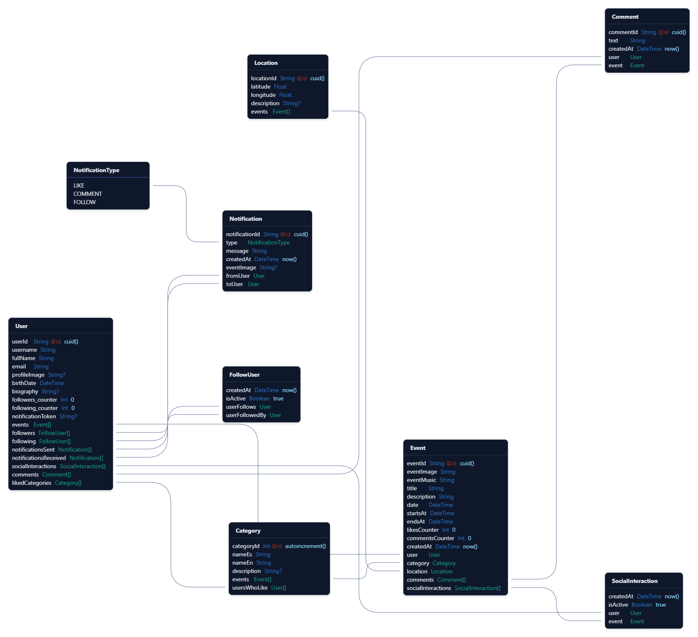

# Eventify API

## Descripción

Eventify API es el backend que potencia la plataforma móvil Eventify, diseñada para la gestión de eventos e interacción entre usuarios. Esta API proporciona todos los endpoints necesarios para soportar las funcionalidades esenciales de la aplicación, incluyendo la administración de eventos, la conexión entre usuarios y características sociales como seguidores, notificaciones y comentarios.

## Tecnologías Utilizadas

- **Node.js**: Entorno de ejecución para JavaScript del lado del servidor.
- **Express**: Framework web para Node.js que facilita la creación de APIs RESTful.
- **Prisma**: ORM (Object-Relational Mapping) para interactuar con la base de datos.
- **PostgreSQL**: Sistema de gestión de bases de datos relacional.
- **Supabase**: Plataforma de backend como servicio (BaaS) para autenticación y almacenamiento.
- **TypeScript**: Lenguaje de programación que añade tipado estático a JavaScript.
- **Zod**: Biblioteca para validación de esquemas.
- **Faker.js**: Biblioteca para generar datos de prueba realistas.

## Estructura del Proyecto

```
api/
├── db/
│   ├── prisma/
│   │   ├── migrations/      # Migraciones de la base de datos
│   │   └── schema.prisma    # Esquema de la base de datos
│   ├── seeder.ts            # Script para poblar la base de datos con datos de prueba
│   └── clearDatabase.ts     # Script para limpiar la base de datos
├── server.js                # Punto de entrada de la aplicación y definición de endpoints
├── validationSchemas.js     # Esquemas de validación para los datos de entrada
├── authenticateUser.js      # Middleware de autenticación
├── .env                     # Variables de entorno (no incluido en el repositorio)
├── .env.example             # Ejemplo de variables de entorno
├── package.json             # Dependencias y scripts
└── README.md                # Documentación del proyecto
```

## Modelos de Datos

La API gestiona los siguientes modelos principales:

- **User**: Usuarios de la plataforma con información de perfil.
- **Event**: Eventos creados por los usuarios con detalles como título, descripción, fecha, etc.
- **Category**: Categorías para clasificar los eventos (Fiestas, Conciertos, Deportes, etc.).
- **Location**: Ubicaciones geográficas de los eventos.
- **Comment**: Comentarios de los usuarios en los eventos.
- **SocialInteraction**: Interacciones sociales como "me gusta" en eventos.
- **FollowUser**: Relaciones de seguimiento entre usuarios.
- **Notification**: Notificaciones para los usuarios sobre actividades en la plataforma.

### Diagrama Entidad-Relación

A continuación se muestra el diagrama Entidad-Relación de la base de datos:



## Requisitos Previos

- Node.js (v18 o superior)
- npm o yarn
- PostgreSQL
- Cuenta en Supabase

## Configuración del Entorno

1. Clona el repositorio:
   ```bash
   git clone https://github.com/tu-usuario/eventify-api.git
   cd eventify-api
   ```

2. Instala las dependencias:
   ```bash
   npm install
   # o
   yarn install
   ```

3. Configura las variables de entorno:
   - Crea un archivo `.env` en la raíz del proyecto basado en `.env.example`
   - Añade las siguientes variables:
     ```
     SUPABASE_URL=tu_url_de_supabase
     SUPABASE_ANON_KEY=tu_clave_anonima_de_supabase
     DATABASE_URL=tu_url_de_base_de_datos
     DIRECT_URL=tu_url_directa_de_base_de_datos
     ```

4. Configura la base de datos:
   ```bash
   npm run db:push
   # o
   yarn db:push
   ```

5. (Opcional) Poblar la base de datos con datos de prueba:
   ```bash
   npm run db:seed
   # o
   yarn db:seed
   ```

## Ejecución de la API

### Desarrollo

Para iniciar la API en modo desarrollo:

```bash
npm run start:dev
# o
yarn start:dev
```

### Producción

Para iniciar la API en modo producción:

```bash
npm start
# o
yarn start
```

## Endpoints Principales

La API proporciona los siguientes endpoints principales:

### Autenticación
- La autenticación se maneja a través de Supabase Auth con tokens JWT.

### Usuarios
- `GET /api/users/:userId` - Obtener detalles de un usuario
- `PUT /api/users/:userId` - Actualizar perfil de usuario
- `GET /api/users/:userId/followers` - Obtener seguidores de un usuario
- `GET /api/users/:userId/following` - Obtener usuarios seguidos por un usuario
- `POST /api/users/:userId/follow` - Seguir a un usuario
- `DELETE /api/users/:userId/follow` - Dejar de seguir a un usuario
- `GET /api/users/search` - Buscar usuarios

### Eventos
- `GET /api/events` - Obtener lista de eventos
- `POST /api/events` - Crear un nuevo evento
- `GET /api/events/:eventId/:userId` - Obtener detalles de un evento
- `PUT /api/events/:eventId` - Actualizar un evento
- `DELETE /api/events/:eventId` - Eliminar un evento
- `GET /api/events/search` - Buscar eventos
- `GET /api/events/user/:userId` - Obtener eventos de un usuario

### Interacciones Sociales
- `POST /api/events/:eventId/like` - Dar "me gusta" a un evento
- `DELETE /api/events/:eventId/like` - Quitar "me gusta" de un evento
- `POST /api/events/:eventId/comment` - Comentar en un evento
- `GET /api/events/:eventId/comments` - Obtener comentarios de un evento

### Notificaciones
- `GET /api/notifications/:userId` - Obtener notificaciones de un usuario

### Categorías
- `GET /api/categories` - Obtener todas las categorías

### Ubicaciones
- `POST /api/locations` - Crear una nueva ubicación
- `DELETE /api/locations/:locationId` - Eliminar una ubicación

## Herramientas de Desarrollo

- **Prisma Studio**: Interfaz visual para explorar y modificar los datos de la base de datos.
  ```bash
  npm run db:studio
  # o
  yarn db:studio
  ```

## Contacto

Para preguntas o sugerencias, por favor contacta a valeraruggierotesisucv@gmail.com